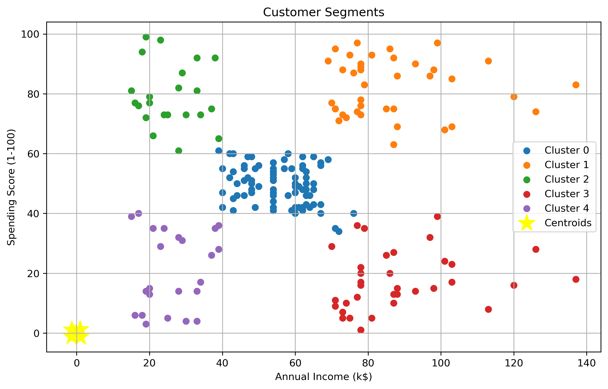
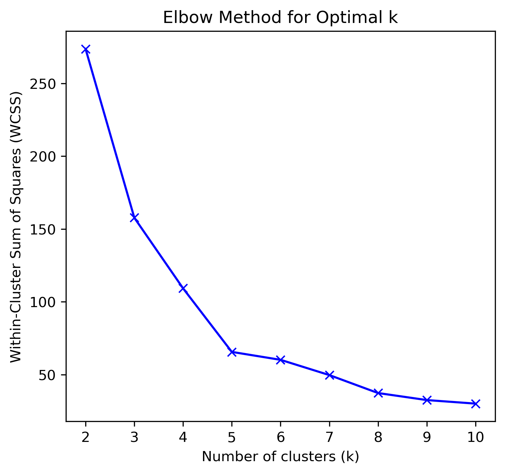
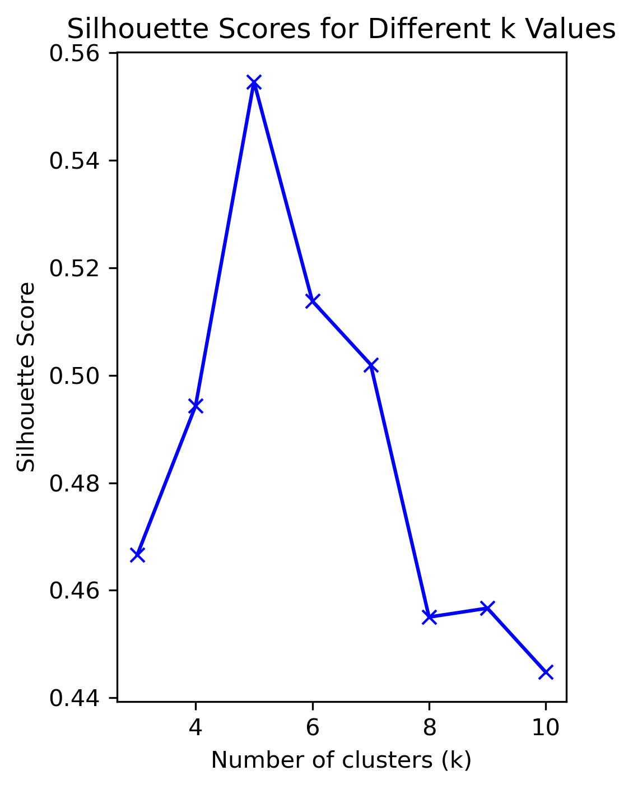

# 🛍️ Customer Segmentation using K-Means Clustering

*(Customer segments based on income and spending patterns)*

## 📌 Project Overview

This project performs customer segmentation for a mall using K-Means clustering, an unsupervised machine learning technique. By analyzing customer demographics and behavior, we identify distinct customer groups to enable targeted marketing strategies.

## 🛠️ Tools Used

- Python 3
- Scikit-learn
- Pandas
- Matplotlib
- NumPy

## 📊 Dataset

The Mall Customer Segmentation Dataset contains:

- **CustomerID**: Unique identifier
- **Gender**: Male/Female
- **Age**: Customer age
- **Annual Income (k$)**: Yearly earnings
- **Spending Score (1-100)**: Mall spending behavior score

## 🔍 Methodology

### 1. Data Preparation

- Selected relevant features: Annual Income and Spending Score
- Standardized data using StandardScaler

### 2. Determining Optimal Clusters

Used two methods to find the ideal number of clusters (k):

*Elbow Method showing optimal k=5*

*Silhouette analysis confirming k=5 provides good separation*

### 3. K-Means Clustering

- Performed clustering with k=5
- Visualized results with cluster centroids

## 📈 Cluster Analysis

| Cluster | Avg Age | Avg Income ($k) | Avg Spending Score | Dominant Gender | Count |
| ------- | ------- | --------------- | ------------------ | --------------- | ----- |
| 0       | 42.7    | 55.3            | 49.5               | Female          | 81    |
| 1       | 32.7    | 86.5            | 82.1               | Female          | 39    |
| 2       | 25.3    | 25.7            | 79.4               | Female          | 22    |
| 3       | 41.1    | 88.2            | 17.1               | Male            | 35    |
| 4       | 45.2    | 26.3            | 20.9               | Female          | 23    |

**Silhouette Score**: 0.55 (indicates reasonably good separation between clusters)

## 🎯 Customer Segments Identified

1. **💰 Balanced Spenders (Cluster 0)**:Middle-aged customers with average income and moderate spending habits
2. **🎯 Premium Customers (Cluster 1)**:Younger, high-income individuals who spend liberally - prime targets for luxury items
3. **💸 Budget Enthusiasts (Cluster 2)**:Young shoppers with limited income but high spending propensity
4. **🔄 Potential Engagers (Cluster 3)**:Affluent middle-aged customers who currently spend less
5. **🧓 Conservative Shoppers (Cluster 4)**:
   Older customers with limited spending power

## 💡 Business Recommendations

- **🎁 Target Cluster 1** with exclusive previews of new collections
- **📢 Launch engagement campaigns** for Cluster 3 to understand their preferences
- **🛒 Create value bundles** for Cluster 2
- **👵 Develop senior-friendly initiatives** for Cluster 4
- **🔄 Maintain current strategies** for Cluster 0

## 📂 Project Structure
